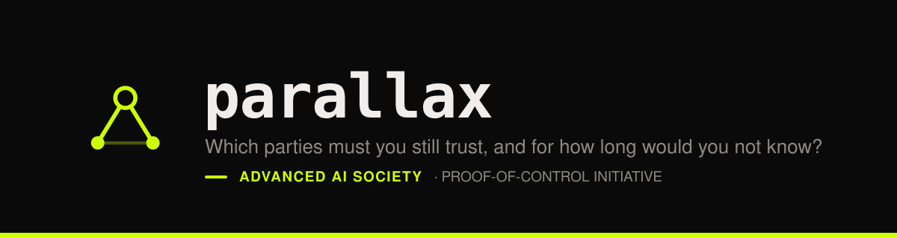
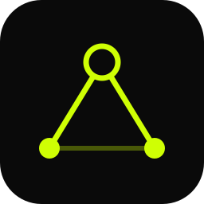

<p align="center">
  
</p>

<p align="center">
  
  
  
  
</p>

---

## "There is nobody left to trust"

That sentence appears in verifiability standards, confidential-computing
marketing, and more than one zero-knowledge pitch deck. It is false, and you
can check that it is false in about four seconds.

Somebody hands you a signed attestation. It says a particular piece of software
ran inside a hardware-protected environment on a machine you do not own. The
pitch is that you no longer have to take anyone's word for it.

So check it. Here is what you actually did:

```console
$ parallax solve examples/sigma2-tdx.toml

PRINCIPAL                     CAPABILITY                          DETECT    IMPACT
did:web:cloud.example.com     measurement_injection_resistance    never     Soundness
did:web:intel.com             silicon_and_microcode_integrity     never     Soundness
did:web:pcs.intel.com         accurate_collateral_issuance        43200s    Revocation
did:web:rvp.example.org       golden_value_correctness            never     Soundness
urn:qe:tdx                    quote_signing_honesty               never     Soundness

5 assumptions, 5 principals
```

Five parties. You did not remove trust; you moved it.

And the column that should stop the conversation is not the count — it is
`DETECT`. **Four of those five have no detection mechanism at all.** If Intel's
silicon is subverted, or the quoting enclave's key leaks, or the reference
values are wrong, the attestation still verifies cryptographically. Nothing
anywhere in the system contradicts it. The failure is silent and it is
permanent.

`never` is not a large number. It means nobody will ever find out.

---

## What parallax does

You describe a deployment — what mechanisms it uses, who operates them. It
computes the **residual trust set**: every party whose dishonesty would change
the answer, what each one could do, and how long you would not know.

It is a small Rust program. The interesting part is not the code; it is that
the answer is *computed* rather than argued about, which turns out to change
what you find.

---

## Two results we did not expect

### Defence in depth that isn't

A deployment combining a hardware TEE with a zero-knowledge proof of the same
computation. Two independent layers — that is the whole point of building it
that way.

```console
$ parallax solve examples/sigma5-hybrid.toml --shared

SHARED DEPENDENCIES — layers that are not independent:
  did:web:buildco.example
    tee_attestation
        golden_value_correctness (never)
    zk_proof
        sound_arithmetization (never)
```

One build pipeline produces both the measured reference values *and* the
circuit constraints. Compromise it once and both layers fall together. Nobody
had noticed, and nothing in either layer's own documentation would tell you.

### The ladder does not exist

Verifiability standards are built on tiers — a ladder you climb by adopting
stronger mechanisms. Compare a hardware TEE against a zero-knowledge system:

```console
$ parallax compare examples/sigma2-tdx.toml examples/sigma4-zk.toml

Incomparable

Neither deployment is more verifiable than the other.
No ordinal tier can rank these two.
```

Their trust sets are disjoint. Neither contains the other, so no ordering puts
one above the other. We tested the four ways we could think of to rank
deployments anyway — set size, set inclusion, detection latency, cost of
collusion. **All four fail**, each differently:

| Ordering | What happens |
| :-- | :-- |
| Set size | Ranks a plain software host **above** a hardware TEE. The way to climb is to write down less. |
| Set inclusion | Ranks nothing. The sets are disjoint. |
| Detection latency | Every deployment scores `never`. Separates nothing. |
| Collusion cost | Not derivable from a description. It is a fact about the adversary, not the system. |

If that holds up, conformance should publish a trust set, not claim a tier.

---

## Try it

```bash
git clone https://github.com/Task-force-for-AI-agents-in-Healthcare/parallax
cd parallax
cargo run -- solve examples/sigma2-tdx.toml
```

Six deployments ship in [`examples/`](examples): a software-only host, an Intel
TDX confidential VM, a 5-of-7 witness quorum, a zero-knowledge rollup, the
hybrid above — and a variant of the hybrid with two separate build pipelines,
which correctly reports nothing. A finding you cannot turn off isn't a finding.

## The five commands

| | |
| :-- | :-- |
| `solve <file>` | compute the trust set — `--shared` finds layers that aren't independent, `--format json` emits a signed-manifest-shaped artifact |
| `compare <a> <b>` | is one deployment more verifiable than another? (usually: no) |
| `diff <a> <b>` | what changed — exits non-zero, so it works as a CI gate |
| `check <manifest> --policy <p>` | reject a deployment that exceeds your local trust policy |
| `explain <file> -p <who>` | why is this party in my trust set? |

Cyclic delegation terminates by construction — a 300-node cycle resolves in
about 0.01 s. That falls out of modelling the trust set as a bounded lattice,
which is a simpler argument than the tabled resolution we first reached for.

---

## What is real, and what is not

This project is about not overclaiming, so:

**Real.** The composition rules, the fixpoint, the manifest schema, and every
comparison the tool reports. Malformed input is an error, never a panic —
including hostile input, which is tested directly.

**The limit that matters.** parallax computes over the dependencies **you
encode**. It cannot discover one you left out. A confident five-party answer
where a sixth dependency exists off-model is a *wrong* answer, not a partial
one — and it is wrong in a format designed to be trusted. That is worse than no
tool at all. If you take one thing from this repository, take that sentence
rather than the incomparability result.

**The evidence base is five architectures we wrote ourselves** (six files —
the sixth is the negative control). Nothing here has been validated against
somebody else's production system. The independent-encoding experiment we
propose as the answer to the limit above has not been run.

---

## How this maps to the standard

parallax is a research tool for the
[**Proof-of-Control Standard**](https://github.com/AAI-Society/ov-poc-standard).
It implements one of its requirements, and contradicts three of its claims:

| | Standard | |
| :-- | :-- | :-- |
| ⚠️ | **C8, Tier 3** — *"the trusted party is removed"* | five parties remain, four undetectable |
| ⚠️ | **C8.1** — deployments sit on an ordered ladder | two deployments can be incomparable |
| ⚠️ | **C10.2 example** — a ZK deployment has the *"narrowest trust base"* | the sets are disjoint; neither is narrower |
| ✅ | **C10.2** — *`[WG-INPUT NEEDED]`: the disclosure format is not yet defined* | emits one, generated rather than written |
| ✅ | **C10.3.3** — an automated validator per claimed Tier | `parallax check`, exits non-zero, runs in CI |

**[→ Full mapping, with the suggested revisions](docs/STANDARD-MAP.md)**

## The paper

[**A Trust Calculus for Attestation Tiers**](paper/main.pdf) — the full argument,
with the formalism, the termination proof, and every number generated from this
repository rather than typed. Source in [`paper/`](paper); it builds with
`tectonic`.

Every figure in the results sections is `\input` from [`results/`](results),
which CI regenerates and fails on drift — a number in the paper cannot disagree
with the code that produced it. The headline counts are generated *as words*,
after a draft of the paper claimed "three of five" while its own tables said
four.

[**What building this established**](docs/parallax-outcomes.pdf) — what the
implementation settled, and the five defects found along the way. Every one was
correct code implementing a subtly wrong specification, producing a confident
wrong answer rather than an error.

## Licence

Apache-2.0 throughout, code and paper alike. Built for the
[Advanced AI Society](https://advancedaisociety.org) Proof-of-Control initiative —
see [**AAI-Society/ov-poc-standard**](https://github.com/AAI-Society/ov-poc-standard).

<p align="center"></p>
